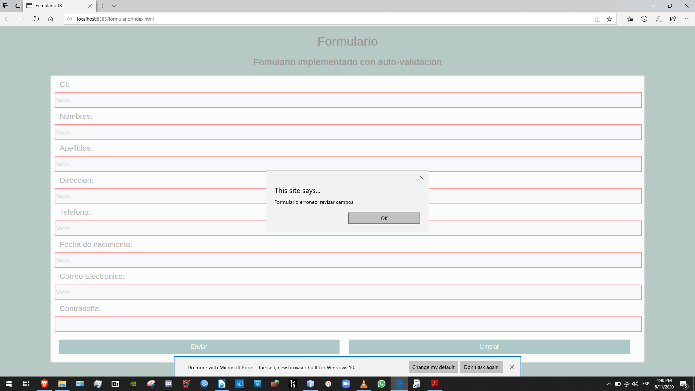

# Practica03-Javascript-
Practica03–Javascript”
## Diseñar una interfaz en HTML que permita ingresar los siguientes campos en un formulario: cedula, nombres, apellidos, dirección, teléfono, fecha de nacimiento, correo electrónico y contraseña. Luego, usando funciones de JavaScript se pide validar que todos los campos han sido ingresados, además; que los valores ingresados en cada campo del formulario sean correctos teniendo en cuenta las siguientes condiciones:
- Se debe validar qué, en el campo de la cedula, se ingrese sólo números y que la misma sea correcta, en base, al último dígito verificador.
- Se debe validar qué, en el campo del nombres, ingrese exclusivamente dos nombre y que permita ingresar sólo letras, por ejemplo: “Gabriel Alejandro”, es válido; “Gabriel”, no es válido.
- Se debe validar qué, en el campo del apellidos, ingrese exclusivamente dos apellidos y que permita ingresar sólo letras, por ejemplo: “León Paredes”, es válido; “León”, no es válido.
- Se debe validar qué, en el campo del teléfono, permita ingresar sólo números y un máximo de 10 caracteres numéricos.
- Se debe validar que la fecha de nacimiento ingrese en el formato dd/mm/yyyy.
- Se debe validar qué, en el campo correo electrónico, permita ingresar un correo válido. Se considera un correo válido, cuando comienza por tres o más valores alfanuméricos, luego un @, seguido por la extensión “ups.edu.ec” o “est.ups.edu.ec”.
- Se debe validar que la contraseña ingresada tenga mínimo 8 caracteres, además, debe incluir al menos: una letra mayúscula, una letra minúscula y un carácter especial (@, _, $)

Las validaciones correspondientes se realizan al momento de tecleear en el fomulario.
Al momento de enviar el fomulario se verifica el estado de cada campo del formulario, para lo cual se utiliza en cada caso una validacion; esto acorde a lo antes especificado. Para mostrar un error este se muestra el el propio formulario, esto en base a la eficiencia de espacio y mas rapida visualizacion.
Al momento de enviar uno o varios campos incompletos estos tienen un tratamiento parecido al anterior.

En el caso de que todo este correcto se visualizara de forma acorde a la imagen anterior.
## Diseñar una interfaz en html que tenga tres botones que diga “Anterior”, “Iniciar”, “Siguiente”, y una imagen. Luego, desde javascript se debe controlar para al hacer clic sobre uno de los botones realice una acción relacionada a una galería de imágenes 

Para el diseño de esta pagina se tuvieron en cuenta factores en el aspecto general. El boton se encuentra, pero los botones correspondiente a siguiente y anterior se ocultan para mejor visualizacion de la imagen.

Al momento de utilizar uno de los botones la animacion se vera desencadenada.

Al momento de llegar a uno de los topes de la galeria entonces si se busca salir acceder a un elemento que esta fuera, se desata un mensaje para el usuario.

Las imagenes en variaran con la utilizacion del boton loot. Pero siempre al inicio el usuario vera la 3 imagen de la galeria.
## Realizar una calculara en HTML usando botones de javascript y una caja de texto para visualizar el resultado. Las operaciones que podrá hacer la calculadora son:: suma, resta, multiplicación y división. Además, se podrá limpiar la memoria de la calculadora. Por último, se debe usar la función eval() para realizar las operaciones aritméticas

Para una mejor implementacion los campos de escritura se deshabilitaron. Dejando asi como unica opcion de ingreso los botones. 
## Codificacion

## Conclusiones
La adicion de JavaScript a la implementacion de una pagina web, repercute de manera directa sobre el tiempo y la planificacion de la misma. Ademas las posibilidades de una pagina web se ven escaladas gracias a esta herramienta que permite interactuar con casi todos los componentes de la pagina.

